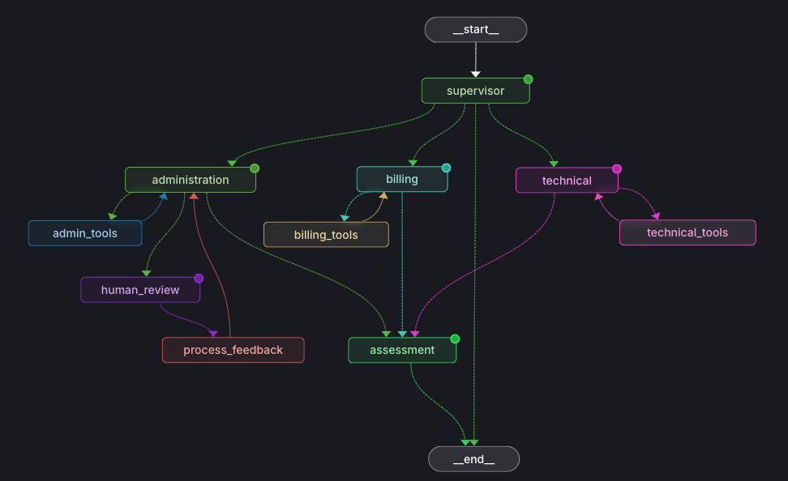
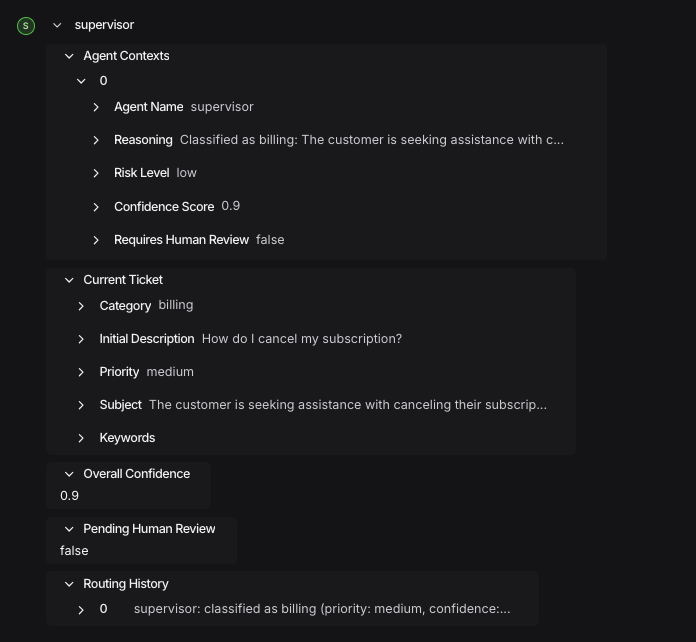
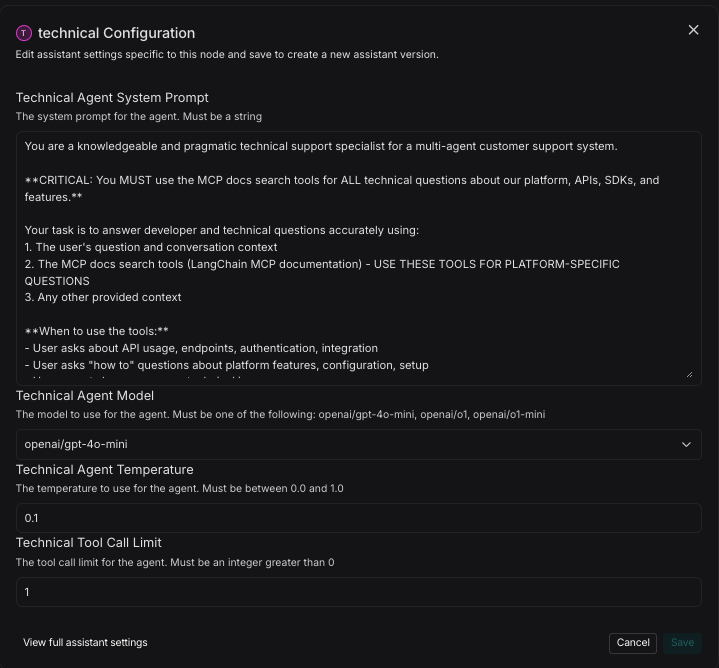
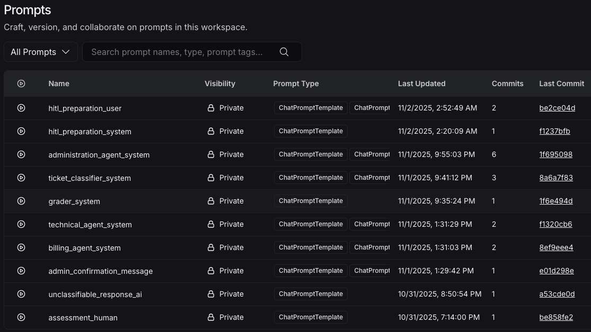
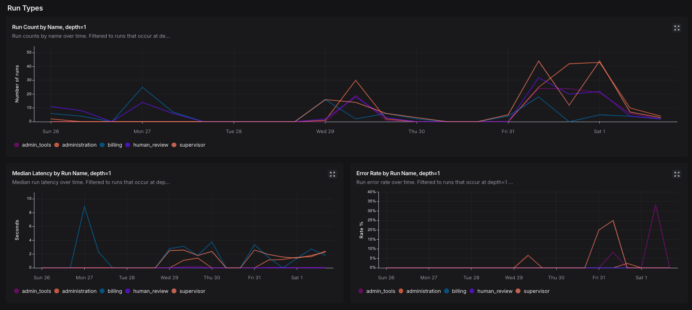
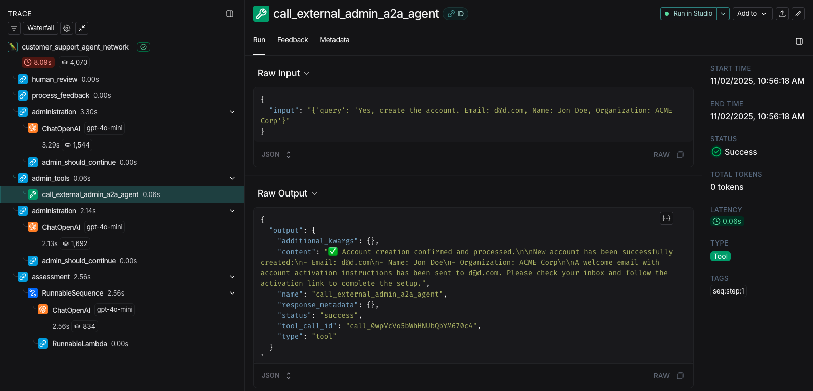
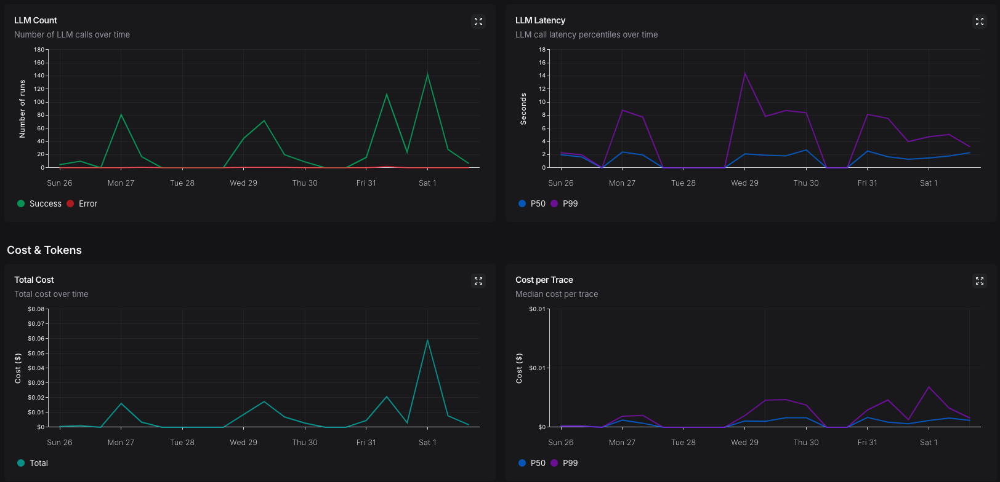
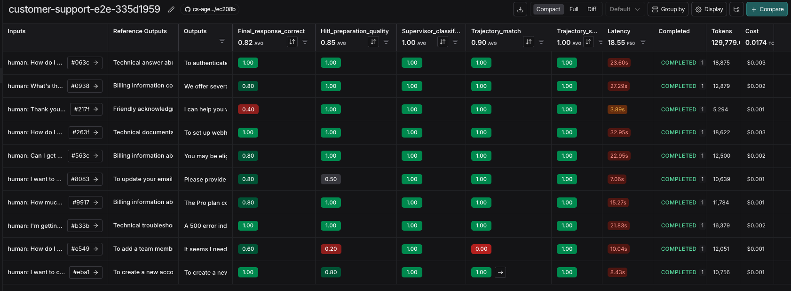

# Architecture

## Table of Contents

| Section | Description |
|---------|-------------|
| [Goal & Purpose](#goal--purpose) | System overview and core capabilities |
| [Design Choices](#design-choices) | Architectural patterns and decisions |
| [Architecture Components](#architecture-components) | Detailed component breakdown |
| [Evaluation System](#evaluation-system) | Testing and quality assurance |
| [Summary](#summary) | Key takeaways |

---

## Goal & Purpose

This agent network is a **multi-agent customer support system** designed to intelligently route and handle customer service tickets across specialized domains. The system provides a **solid foundation and proven patterns** for building complex, multi-step agent workflows.

### Core Capabilities

| Capability | Description |
|------------|-------------|
| **Intelligent routing** | Routes to domain-specific specialists |
| **Structured coordination** | Coordinates between multiple specialized agents |
| **Human-in-the-loop** | Provides oversight for sensitive operations |
| **Tool integration** | Integrates with external systems (documentation, knowledge bases, administrative APIs) |
| **Quality assessment** | Provides confidence scoring for responses |

The system demonstrates how to build **flexible, maintainable agent networks** using LangGraph with explicit graph construction for maximum control and customization.



---

## Design Choices

### Dispatcher → Specialized Agents Model

The system follows a **central dispatcher pattern** where a **Supervisor** node classifies incoming tickets and routes them to specialized agent nodes:

| Agent | Purpose | Integration |
|-------|---------|-------------|
| **Technical Support Agent** | Handles developer questions | MCP (Model Context Protocol) tools for documentation access |
| **Billing Agent** | Answers billing questions | Vector store knowledge base search |
| **Administration Agent** | Manages administrative requests | A2A (Agent-to-Agent) protocol with mandatory human review |

#### Design Benefits

| Benefit | Description |
|---------|-------------|
| **Domain specialization** | Each agent is optimized for its specific task domain |
| **Separation of concerns** | Clear boundaries between routing, execution, and assessment |
| **Scalability** | New specialized agents can be added without modifying existing ones |
| **Quality control** | Centralized assessment and human review at appropriate points |

### Low-Level Explicit Graph Building

Unlike prebuilt LangChain ReAct agents or high-level abstractions, this system **explicitly constructs the graph** using LangGraph's StateGraph API.

#### Approach Comparison

| Aspect | Prebuilt Agents | Explicit Graph Building |
|--------|----------------|------------------------|
| **Control** | Limited to template options | Fine-grained control over execution |
| **Patterns** | Fixed patterns | Custom patterns (ReAct loops, interrupts, etc.) |
| **Flexibility** | Template constraints | Easy modification of structure and routing |
| **Transparency** | Hidden execution details | Clear visibility into execution flow |
| **Complexity** | Simple workflows | Complex multi-agent workflows |

#### Benefits of Explicit Construction

| Benefit | Description |
|---------|-------------|
| **Fine-grained control** | Precise control over node execution, edge conditions, and state transitions |
| **Custom patterns** | Ability to implement specialized patterns (ReAct loops, classifier chains, human-in-the-loop interrupts) |
| **Flexibility** | Easy modification of graph structure, routing logic, and tool integration |
| **Transparency** | Clear visibility into execution flow for debugging and optimization |

The graph is built node-by-node with explicit edges and conditional routing, allowing for complex multi-agent workflows that wouldn't be easily achievable with standard agent templates.

### Node Types & Patterns

Different nodes in the system serve distinct architectural roles:

#### Node Type Classification

| Node Type | Nodes | Purpose |
|-----------|-------|---------|
| **Classifier/Router** | Supervisor, Assessment | Classification and quality evaluation using structured LLM output |
| **ReAct Agent** | Technical Support, Billing, Administration | Implements ReAct loop (Reasoning → Action → Observation) |
| **Control Flow** | Human Review, Process Feedback | Implements interrupt pattern and resumption logic |
| **Tool Execution** | Technical Tools, Billing Tools, Admin Tools | Executes tool calls and returns results |

#### Node Details

| Node | Type | Functionality |
|------|------|--------------|
| **Supervisor** | Classifier/Router | Classifies tickets into categories using Pydantic schemas |
| **Assessment** | Classifier/Router | Evaluates response quality, confidence, and risk |
| **Technical Support** | ReAct Agent | ReAct loop with MCP tool integration |
| **Billing** | ReAct Agent | ReAct loop with vector store knowledge base search |
| **Administration** | ReAct Agent | ReAct loop with A2A agent delegation |
| **Human Review** | Control Flow | Implements interrupt pattern for human-in-the-loop approval |
| **Process Feedback** | Control Flow | Handles resumption after human feedback |
| **Tool Execution Nodes** | Tool Execution | Execute tool calls; separate nodes per domain for isolation |

---

## Architecture Components

### Graph Structure

The graph follows this execution flow:

```
START → Supervisor (classification)
    ├─→ Technical → Technical Tools → Technical (ReAct loop)
    ├─→ Billing → Billing Tools → Billing (ReAct loop)
    └─→ Administration → Admin Tools → Administration → Human Review → Process Feedback → Administration
                                                    ↓
                                            Assessment → END
```

#### Key Characteristics

| Characteristic | Description |
|---------------|-------------|
| **Single entry point** | All requests start at Supervisor |
| **Parallel agent branches** | Three specialized agent paths |
| **ReAct loops** | Technical and Billing agents can iterate with tools |
| **Human-in-the-loop** | Administration path includes mandatory interrupt for review |
| **Quality gate** | Assessment node evaluates all paths before completion |

### State Management: ConversationState

The system uses a shared **ConversationState** that extends LangGraph's `MessagesState`:

#### Core Components

| Component | Source | Purpose |
|-----------|--------|---------|
| **Messages** | Built-in from MessagesState | Conversation history |
| **Agent Contexts** | Custom | Per-agent execution metadata (confidence, reasoning, risk levels) |
| **Routing History** | Custom | Track of node execution path for debugging and evaluation |
| **Human-in-the-loop State** | Custom | Flags and feedback for human review workflow |
| **Quality Metrics** | Custom | Overall confidence, risk assessment, tool call tracking |

#### State Reducers

| Reducer | Behavior | Purpose |
|---------|----------|---------|
| **Agent Contexts** | Append-only list | Track each agent's execution context |
| **Routing History** | Append-only list | Track nodes visited during execution |

#### State Benefits

| Benefit | Description |
|---------|-------------|
| **Context preservation** | Maintains context across agent transitions |
| **Quality tracking** | Tracks quality metrics throughout the conversation |
| **Audit trail** | Provides complete history for debugging and evaluation |
| **Human review** | Enables workflow state management for human-in-the-loop |



### Structured Output Schemas

The system uses **Pydantic models** for structured LLM outputs:

| Schema | Purpose | Fields |
|--------|---------|--------|
| **TicketClassification** | Supervisor's routing decision | category, priority, intent, confidence |
| **Assessment** | Quality evaluation | confidence score, risk level, compliance risks, human review flag |

#### Benefits

| Benefit | Description |
|---------|-------------|
| **Type safety** | Compile-time validation of LLM outputs |
| **Consistency** | Guaranteed output format across executions |
| **Integration** | Easy integration with downstream systems and databases |

### Configuration System: RunnableConfig with Configuration Schema

The graph uses LangGraph's **RunnableConfig** pattern with a custom **Configuration** Pydantic schema that allows **runtime parameter overrides**.

#### Configurable Parameters

| Parameter | Description | Example |
|-----------|-------------|---------|
| **Per-node model selection** | Different LLM models per agent | GPT-4o-mini, GPT-5, Claude Sonnet |
| **Temperature settings** | Customizable creativity/determinism per node | 0.0 for deterministic, 0.7 for creative |
| **System prompts** | Overridable prompts for each agent | Custom prompt per agent node |
| **Tool call limits** | Configurable iteration limits per agent | Max iterations before termination |
| **Human review messages** | Customizable confirmation prompts | Tenant-specific confirmation text |

#### Runtime Override Mechanism

| Step | Implementation | Details |
|------|----------------|---------|
| **Configuration passing** | `RunnableConfig` with `context_schema=Configuration` | Schema defines available parameters |
| **Runtime overrides** | LangGraph Assistants API | Overrides via configuration payload |
| **Parameter access** | `runtime.context` from `RunnableConfig` | Each node accesses its configuration |
| **Default values** | Provided for all parameters | Overrides applied at runtime |

#### Design Benefits

| Benefit | Use Case |
|---------|----------|
| **A/B testing** | Compare models and prompts systematically |
| **Multi-tenant customization** | Different configurations per customer |
| **Gradual rollout** | Incrementally deploy new models/prompts |
| **Fine-tuning** | Adjust individual agent behavior |



### Integrations

| Integration | Used By | Purpose | Key Features |
|------------|---------|---------|--------------|
| **MCP (Model Context Protocol)** | Technical Support agent | Access documentation servers | Dynamic tool discovery and execution |
| **A2A (Agent-to-Agent Protocol)** | Administration agent | Delegate to external administrative agents | Agent-to-agent communication, API key auth |
| **Vector Store (Pinecone)** | Billing agent | Semantic knowledge base search | OpenAI embeddings, scalable retrieval |
| **LangSmith** | All nodes | Observability and evaluation | Tracing, monitoring, dataset management |

#### Integration Details

**MCP (Model Context Protocol)**:
- Dynamic tool discovery and execution
- Enables integration with external documentation systems without hardcoding

**A2A (Agent-to-Agent Protocol)**:
- Demonstrates agent-to-agent communication patterns
- API key authentication propagated from runtime configuration

**Vector Store (Pinecone)**:
- Semantic vector search for billing information
- Uses OpenAI embeddings for query encoding

**LangSmith Integration**:
- Traces all LLM calls, tool invocations, and graph execution
- Enables debugging, performance monitoring, and cost tracking
- Used for evaluation dataset management and experiment tracking

### Authentication & Security

#### Custom Authentication Mechanism

| Component | Implementation | Purpose |
|-----------|----------------|---------|
| **Auth Interface** | LangGraph SDK's `Auth` interface | Request authentication |
| **API Key Validation** | Validates LangSmith API keys from headers | Secure request validation |
| **User Identity** | Extracts user identity and A2A admin agent keys | User-specific credentials |
| **Auth Propagation** | Propagates auth data through graph execution | Secure token passing |

#### Auth Data Propagation Flow

| Step | Mechanism | Implementation |
|------|-----------|----------------|
| **Storage** | Authentication context in `RunnableConfig` | Stored in `configurable` field |
| **Access** | Tools access via runtime configuration injection | Runtime config injection pattern |
| **Usage** | Administration tools use API key for A2A | API key from config for endpoint auth |
| **Wrapper** | Custom wrapper sets runtime config | `admin_tools_with_config` sets config before execution |

#### Pattern Benefits

| Benefit | Description |
|---------|-------------|
| **Secure token passing** | Pass authentication tokens securely through agent workflows |
| **User-specific credentials** | Access user-specific credentials within tool executions |
| **Multi-tenant support** | Implement multi-tenant authentication for agent networks |

### Memory Management: Short-Term Memory with History Cropping

The system implements **short-term memory management** to balance context preservation with token efficiency.

#### Conversation History Formatting Rules

| Rule | Limit | Rationale |
|------|-------|-----------|
| **Message count** | Up to 10 previous messages | Provides sufficient context without token bloat |
| **Tool message exclusion** | Excludes tool messages | Removes internal implementation details |
| **Message truncation** | 300 characters per message | Prevents token overflow for very long messages |
| **Format preservation** | User/assistant dialogue format | Maintains context understanding |

#### Rationale

| Rationale | Benefit |
|-----------|---------|
| **Token efficiency** | Prevents context window overflow in long conversations |
| **Relevance** | Recent messages are more important for classification and responses |
| **Clarity** | Tool messages excluded from user-facing context to reduce noise |
| **Performance** | Truncation prevents slow processing of very long messages |

#### Implementation Benefits

| Benefit | Description |
|---------|-------------|
| **Practical memory management** | Demonstrates production-ready memory management |
| **Balance** | Balances context richness with cost and performance |
| **Selective inclusion** | Selective history inclusion based on node needs |

### Prompt Management: LangSmith Prompt Hub with Local Fallback

The system loads prompts from **LangSmith Prompt Hub** with automatic fallback to local text files.

#### Loading Strategy

| Source | Trigger | Use Case |
|--------|---------|----------|
| **Primary (LangSmith)** | `PULL_PROMPTS_FROM_LANGSMITH=true` | Production, A/B testing |
| **Fallback (Local)** | `PULL_PROMPTS_FROM_LANGSMITH=false` | Development, offline mode |
| **Caching** | After first load | Avoids repeated API calls |

#### Benefits

| Benefit | Description |
|---------|-------------|
| **Centralized management** | Prompts can be updated in LangSmith without code changes |
| **Version control** | LangSmith tracks prompt versions and changes |
| **Offline capability** | Local fallback ensures system works without LangSmith connectivity |
| **Development workflow** | Developers can edit local files for testing |

#### Prompt Organization

| Prompt Type | Purpose | Location |
|-------------|---------|----------|
| **System prompts** | Agent node instructions | `src/prompts/*_system.txt` |
| **Human prompts** | Assessment and human review | `src/prompts/assessment_*.txt` |
| **Grader prompts** | LLM-as-judge evaluators | `src/prompts/grader_*.txt`, `hitl_preparation_*.txt` |

> 💡 **All prompts are externalized, not hardcoded in Python**



### Model Selection & LLM Configuration

The system supports multiple LLM providers and models per node.

#### Available Models

| Model | Provider | Default Use Case |
|-------|----------|------------------|
| **GPT-4o-mini** | OpenAI | Default (cost-effective, good for most tasks) |
| **GPT-4o** | OpenAI | Higher quality tasks |
| **GPT-5** | OpenAI | Premium quality for critical operations |
| **Claude Sonnet 4.5** | Anthropic | Premium quality, excels at technical tasks |
| **Claude Haiku 4.5** | Anthropic | Cost-effective alternative |
| **o1/o1-mini** | OpenAI | Advanced reasoning (no tool support) |

#### Model Selection Strategy

| Factor | Consideration | Impact |
|--------|---------------|--------|
| **Task complexity** | Simple classification vs. complex reasoning | Model capability requirements |
| **Tool usage requirements** | Some models (o1) don't support tools | Tool compatibility needed |
| **Cost constraints** | High-volume nodes use cheaper models | Budget optimization |
| **Quality requirements** | Security-critical nodes use premium models | Risk mitigation |

#### Comprehensive Analysis

> 📊 **See [LLM_MODEL_ANALYSIS.md](./LLM_MODEL_ANALYSIS.md) for:**
> - Detailed model capabilities comparison
> - Node-by-node recommendations
> - Cost-efficiency trade-offs
> - Provider strategy (OpenAI vs. Anthropic)
> - Hardening roadmap and implementation priorities

#### Key Insights

| Insight | Implication |
|---------|-------------|
| **Selective upgrades** | Not all nodes benefit from premium models |
| **Administration is critical** | Security-sensitive operations warrant premium models (Claude Sonnet 4.5 or GPT-5) |
| **Technical benefits from Claude** | Claude Sonnet 4.5 excels at coding/technical tasks |
| **Hybrid strategy** | Using both OpenAI and Anthropic optimizes for task-specific strengths |

### Observability

The agent network integrates with **LangSmith** to provide full observability across the entire system.

#### Observability Components

| Component | Description | Provides |
|-----------|-------------|----------|
| **Traces** | Execution tracking | Runs, spans, execution paths |
| **Threads** | Conversation tracking | Multi-turn sequences, lifecycle |
| **Monitoring** | Performance and cost | Metrics, latency, costs |

#### Traces

| Element | Description | Purpose |
|--------|-------------|---------|
| **Runs** | Individual execution units | LLM calls, tool invocations, node executions |
| **Spans** | Nested execution contexts | Hierarchical relationships within runs |
| **Trace collection** | Automatic organization | Detailed view of request execution path |

#### Threads

| Feature | Description |
|---------|-------------|
| **Conversation sequences** | Sequence of traces for a single conversation |
| **Multi-turn tracking** | Context maintained across interactions |
| **End-to-end visibility** | Complete conversation lifecycle tracking |

#### Monitoring

| Metric Type | Tracked Data | Use Case |
|-------------|--------------|----------|
| **LLM call tracking** | Latency, token usage, cost metrics | Performance and cost analysis |
| **Tool call monitoring** | Execution times, success rates, error patterns | Reliability and debugging |
| **Performance metrics** | System latency, throughput, resource utilization | Optimization |
| **Cost tracking** | Per-request and aggregate cost analysis | Budget management |

#### Observability Benefits

| Benefit | Description |
|---------|-------------|
| **Debugging** | Identify bottlenecks, errors, and unexpected behavior in production |
| **Performance optimization** | Analyze execution patterns to improve speed and efficiency |
| **Cost management** | Track and optimize spending across different models and nodes |
| **Quality assurance** | Monitor response quality and system reliability over time |





---

## Evaluation System

### Evaluation Architecture

The system includes a comprehensive evaluation suite that generates datasets and experiments in LangSmith.

#### Evaluation Types

| Type | Evaluators | Purpose |
|------|------------|---------|
| **LLM-as-Judge** | Final Response Correctness, HITL Preparation Quality | Quality assessment with context awareness |
| **Deterministic** | Trajectory Match, Trajectory Subsequence, Supervisor Classification | Exact matching and validation |

##### LLM-as-Judge Evaluators

| Evaluator | Description | Configuration |
|-----------|-------------|---------------|
| **Final Response Correctness** | Compares actual vs. expected responses | Structured output (Pydantic schemas) |
| **HITL Preparation Quality** | Evaluates human-in-the-loop output quality | Domain-specific grader |
| **Grader Models** | Consistent scoring with structured outputs | Pydantic schemas for validation |

##### Deterministic Evaluators

| Evaluator | Type | Use Case |
|-----------|------|----------|
| **Trajectory Match** | Exact matching | Exact node sequence validation |
| **Trajectory Subsequence** | Partial matching | Flexible execution path evaluation |
| **Supervisor Classification** | Exact matching | Category validation |

#### Evaluation Workflow

| Step | Activity | Output |
|------|----------|--------|
| **Dataset definition** | JSON files with inputs, outputs, trajectories | Structured test data |
| **Evaluation execution** | Run evaluators against datasets | Experiment results in LangSmith |
| **Result analysis** | Scores, traces, metadata | Performance insights |
| **Experiment tracking** | Track over time and across changes | Trend analysis |

#### Dataset Management

| Aspect | Implementation | Benefit |
|--------|----------------|---------|
| **Storage** | LangSmith for version control | Collaboration and history |
| **Types** | Curated, synthetic, development | Comprehensive coverage |
| **Interface** | Command-line for different datasets | Flexible testing |
| **Visualization** | Automatic upload to LangSmith | Easy analysis |

#### Integration with LangSmith

| Feature | Description | Benefit |
|---------|-------------|---------|
| **Experiment creation** | All evaluations create experiments | Centralized tracking |
| **Trace inclusion** | Full graph execution paths | Complete debugging |
| **Score aggregation** | Comparison across experiments | Trend analysis |
| **Systematic testing** | Model upgrades, prompt changes, architecture modifications | Continuous improvement |

#### Evaluation Patterns Demonstrated

| Pattern | Description | Example |
|---------|-------------|---------|
| **Hybrid evaluation** | Combining LLM judges with deterministic checks | Best of both worlds |
| **Trajectory evaluation** | Validating execution paths, not just outputs | Comprehensive validation |
| **Domain-specific evaluation** | Specialized evaluators for specific domains | HITL quality for admin cases |
| **Cost-aware evaluation** | Different evaluators for CI/CD vs. production | Optimized for context |

#### Evaluation System Benefits

| Benefit | Description |
|---------|-------------|
| **Systematic testing** | Methodical approach to testing multi-agent workflows |
| **Best practices** | LLM evaluation patterns (judges, structured outputs, context-aware scoring) |
| **Experiment management** | Integration with LangSmith for experiment tracking |
| **Continuous improvement** | Workflow for iterating on agent networks |


---

## Summary

This architecture provides a **solid foundation** for building complex, multi-agent systems.

### Core Strengths

| Strength | Description |
|----------|-------------|
| **Flexible routing** | Specialized agents for domain-specific tasks |
| **Explicit control** | Fine-grained control over execution flow |
| **Structured coordination** | Shared state and schemas for consistency |
| **Runtime configurability** | Models, prompts, and behavior configurable at runtime |
| **Comprehensive evaluation** | Evaluation system for continuous improvement |

### Key Balance

The system demonstrates how to balance **flexibility and control** with **practical constraints** (cost, performance, token limits) in real-world agent deployment scenarios.

