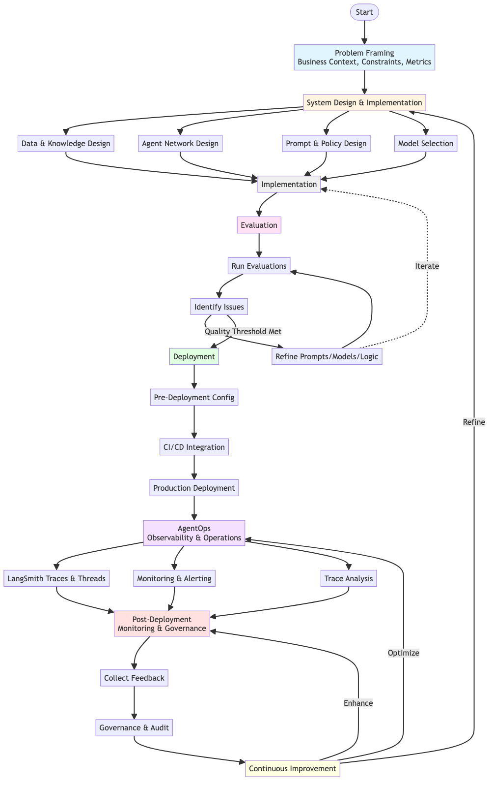

# SDLC for Agentic AI

This document outlines the iterative development lifecycle for building agentic AI systems, with focus on steps critical to agent architectures that differ from traditional software development.

For detailed architecture information, see [ARCHITECTURE.md](./ARCHITECTURE.md). For business context, see [BUSINESS_OVERVIEW.md](./BUSINESS_OVERVIEW.md).

---

## Table of Contents

| Phase | Focus Area | Key Activities |
|-------|-----------|---------------|
| [Phase 1: Problem Framing](#phase-1-problem-framing) | Business Context | Requirements, constraints, success metrics |
| [Phase 2: System Design & Implementation](#phase-2-system-design--implementation) | Architecture | Data design, network topology, prompts, models |
| [Phase 3: Evaluation-Driven Iteration](#phase-3-evaluation-driven-iteration) | Quality Assurance | Dataset creation, evaluators, refinement cycles |
| [Phase 4: Deployment](#phase-4-deployment) | Production Readiness | Configuration, CI/CD, rollout strategies |
| [Phase 5: AgentOps](#phase-5-agentops-observability--operations) | Observability | Traces, monitoring, debugging |
| [Phase 6: Post-Deployment](#phase-6-post-deployment-monitoring--governance) | Continuous Improvement | Feedback loops, governance, risk management |

---

## Overview

Agentic AI systems require an iterative, evaluation-driven development process that emphasizes prompt engineering, model selection, agent orchestration, and continuous monitoring. Unlike traditional software where code changes drive behavior, agent systems require careful tuning of prompts, models, and agent topologies.

*Diagram source: [`diagrams/sdlc-cycle.mmd`](diagrams/sdlc-cycle.mmd)*

### Key Differences from Traditional SDLC

| Aspect | Traditional SDLC | Agentic AI SDLC |
|--------|------------------|-----------------|
| **Primary Focus** | Code changes | Prompt engineering & model selection |
| **Iteration Driver** | Feature requirements | Evaluation results |
| **Quality Assurance** | Unit/integration tests | LLM-as-judge + deterministic evaluators |
| **Deployment** | Code versioning | Prompt/model versioning + configuration |
| **Monitoring** | Application metrics | LLM traces, token usage, quality scores |

---

## Phase 1: Problem Framing

### Understanding Business Context

| Activity | Description | Critical Questions |
|----------|-------------|-------------------|
| **Identify domain requirements** | Understand the problem domain, constraints, and business objectives | What problems are we solving? What are the business goals? |
| **Define success metrics** | Establish KPIs and quality thresholds (response time, accuracy, cost, CSAT) | How will we measure success? What are acceptable thresholds? |
| **Identify constraints** | Regulatory requirements, existing infrastructure, cost limitations | What legal/compliance requirements exist? What systems must integrate? |
| **User journey mapping** | Understand user interactions and expected workflows | How do users interact with the system? What are critical paths? |

### Example: Acme Corp. Case Study

| Aspect | Details |
|--------|---------|
| **Domain** | Customer support across technical, billing, and administration |
| **Constraints** | Regulatory compliance requiring explicit consent for admin actions |
| **Existing Infrastructure** | Pinecone knowledge base, A2A administrative agent |
| **Success Metrics** | 50% cost reduction, 40% CSAT improvement, <15% escalation rate |

---

## Phase 2: System Design & Implementation

### 2.1 Data & Knowledge Design

#### Retrieval Strategy

| Component | Description | Example |
|-----------|-------------|---------|
| **Vector store integration** | Design semantic search for knowledge bases | Pinecone for billing information |
| **Documentation access** | Design MCP integration for dynamic technical documentation | Real-time API documentation lookup |
| **Knowledge organization** | Structure data for effective retrieval (metadata, categorization, chunking) | Topic-based categorization with metadata tags |
| **Fallback mechanisms** | Handle cases where knowledge base doesn't have answers | Graceful degradation to human escalation |

#### Integration Design

| Aspect | Considerations |
|--------|----------------|
| **External system APIs** | A2A agents, MCP servers, databases |
| **Data flow** | Auth tokens, context propagation, state management |
| **Error handling** | Service unavailability, rate limits, data inconsistencies |

### 2.2 Agent Network Design

#### Topology Decisions

| Decision | Options | Recommendation |
|----------|---------|----------------|
| **Graph structure** | Flat, hierarchical, hybrid | Dispatcher → specialized agents (hierarchical) |
| **Node types** | Routers, ReAct agents, control flow, tool executors | Mix based on task requirements |
| **Execution patterns** | Sequential, parallel, loops, interrupts | ReAct loops for agents, interrupts for HITL |
| **State management** | Global, per-node, hybrid | Shared state schema for context preservation |

#### Pattern Selection Matrix

| Pattern | Use Case | Benefits |
|---------|----------|----------|
| **Centralized dispatcher** | Multi-domain routing | Clear routing logic, easy to maintain |
| **Peer-to-peer** | Direct agent communication | Low latency, flexible |
| **Hierarchical** | Complex multi-level decisions | Scalable, clear hierarchy |
| **Tool node separation** | Domain isolation | Clear boundaries, easier testing |
| **Inline tool calls** | Simple operations | Lower overhead, simpler flow |

#### Tool Design Principles

| Principle | Description | Example |
|-----------|-------------|---------|
| **Tool boundaries** | Clear separation: tools vs. agent reasoning | Vector search = tool, reasoning = agent |
| **Tool composition** | Support tool chaining and multi-tool workflows | Search → Filter → Format pipeline |
| **Tool isolation** | Separate tool nodes per domain | Technical tools ≠ Billing tools ≠ Admin tools |

### 2.3 Prompt & Policy Design

#### Prompt Engineering Checklist

| Aspect | Key Considerations | Best Practices |
|--------|-------------------|----------------|
| **System prompts** | Agent roles, responsibilities, behavioral guidelines | Be explicit, use examples, define constraints clearly |
| **Instruction design** | Tool usage, mandatory behaviors, constraints | State requirements explicitly, avoid ambiguity |
| **Externalization** | Version-controlled storage (LangSmith Prompt Hub or local files) | Never hardcode prompts, enable A/B testing |
| **Iteration** | Continuous testing and refinement | Measure impact, document changes, version control |

#### Policy Definition Framework

| Policy Type | Purpose | Example |
|-------------|---------|---------|
| **Tool usage policies** | When tools must be called | Administration agent must always use A2A tool |
| **Safety policies** | Guardrails, refusal behaviors, risk thresholds | Refuse requests violating compliance |
| **Compliance policies** | Regulatory requirements | Explicit consent for administrative actions |
| **Quality policies** | Confidence thresholds, escalation criteria | Escalate if confidence < 0.7 |

#### Prompt Versioning Strategy

- **Version control**: Track all prompt versions with change descriptions
- **A/B testing**: Compare prompt versions systematically
- **Rollback capability**: Maintain ability to revert to previous versions
- **Storage**: LangSmith Prompt Hub (centralized) + local files (fallback)

### 2.4 Model Selection

#### Model Selection Decision Matrix

| Node Type | Task Characteristics | Recommended Model | Rationale |
|-----------|---------------------|-------------------|-----------|
| **Router/Supervisor** | Classification, structured output | gpt-4o-mini | Cost-effective, sufficient for routing |
| **ReAct Agents** | Tool usage, reasoning | gpt-4o-mini to gpt-4o | Start with mini, upgrade if needed |
| **Critical Operations** | High-stakes decisions, compliance | Claude Sonnet 4.5 or GPT-5 | Premium quality for admin actions |
| **Evaluators** | Quality assessment | gpt-4o-mini | Cost-effective for batch evaluation |

#### Selection Criteria

| Criterion | Questions to Ask |
|-----------|------------------|
| **Task analysis** | Reasoning intensity? Tool requirements? Structured output needs? |
| **Cost-performance** | Quality requirements vs. cost constraints? |
| **Provider selection** | OpenAI vs. Anthropic vs. hybrid? Which fits task characteristics? |
| **Model configuration** | Temperature? Token limits? Tool call limits? |

#### Iterative Refinement Approach

1. **Start**: Cost-effective models (gpt-4o-mini) for most nodes
2. **Evaluate**: Run comprehensive evaluation suite
3. **Identify gaps**: Find nodes with quality issues
4. **Upgrade selectively**: Premium models only where needed
5. **Measure**: Track cost vs. quality improvements

> 💡 **See [LLM_MODEL_ANALYSIS.md](./LLM_MODEL_ANALYSIS.md) for comprehensive model selection guidance**

---

## Phase 3: Evaluation-Driven Iteration

### 3.1 Evaluation Strategy

#### Dataset Creation

| Dataset Type | Purpose | Characteristics |
|--------------|---------|-----------------|
| **Curated datasets** | Real-world validation | Real examples with expected outputs and trajectories |
| **Synthetic datasets** | Comprehensive coverage | Diverse test cases covering edge cases and common scenarios |
| **Trajectory validation** | Execution path validation | Expected execution paths through the graph |
| **Domain-specific datasets** | Specialized testing | Separate datasets per domain (technical, billing, admin) |

#### Evaluator Selection Matrix

| Evaluator Type | Use Case | Advantages | Limitations |
|----------------|----------|------------|-------------|
| **LLM-as-judge** | Response quality, correctness | Handles subjective quality, context-aware | Higher cost, potential bias |
| **Deterministic** | Exact matching, classification | Fast, consistent, low cost | Binary, no nuance |
| **Hybrid approach** | Comprehensive assessment | Best of both worlds | More complex setup |
| **Domain-specific** | Specialized quality (e.g., HITL prep) | Tailored to specific needs | Requires custom implementation |

#### Evaluation Execution Schedule

| Frequency | Trigger | Activities |
|-----------|---------|-----------|
| **Continuous** | CI/CD pipeline | Unit tests, integration tests |
| **On Pull Request** | Code changes | Full evaluation suite |
| **Scheduled** | Daily/Weekly | Regression detection, trend analysis |
| **Before Deployment** | Release candidate | Full validation, quality gates |
| **After Deployment** | Production monitoring | Production-like data evaluation |

### 3.2 Iterative Refinement Cycle

#### Typical Iteration Flow

| Step | Action | Expected Outcome |
|------|--------|------------------|
| **1. Run evaluations** | Execute evaluation suite against current dataset | Baseline metrics and failure identification |
| **2. Identify failures** | Analyze misclassifications, trajectory mismatches, quality issues | List of specific problems to address |
| **3. Root cause analysis** | Determine if issue is prompt, model, routing logic, or data | Clear understanding of root cause |
| **4. Targeted fixes** | Apply fixes based on root cause | Improved prompts/models/logic/data |
| **5. Re-evaluate** | Run evaluations again to validate improvements | Confirmation of improvement or need for further iteration |
| **6. Monitor metrics** | Track KPIs (CSAT, escalation rate, cost) | Business impact measurement |

#### Fix Strategies by Root Cause

| Root Cause | Fix Strategy | Example Actions |
|------------|--------------|-----------------|
| **Prompt issue** | Refine prompts for better instruction following | Add explicit examples, clarify constraints |
| **Model limitation** | Upgrade models for nodes showing quality gaps | Switch from gpt-4o-mini to gpt-4o for specific node |
| **Routing logic** | Adjust routing logic for classification errors | Enhance supervisor prompt with routing rules |
| **Data/knowledge gap** | Enhance knowledge base for information gaps | Add missing documentation, expand KB coverage |

#### Real-World Examples (Acme Corp.)

| Issue | Root Cause | Fix | Result |
|-------|------------|-----|--------|
| **SSO setup misrouted** | Supervisor prompt lacked explicit admin routing rules | Enhanced supervisor prompt with routing examples | Correct classification |
| **Admin agent not using tool** | Prompt didn't mandate tool usage | Added mandatory tool usage directives with examples | Consistent tool usage |
| **Trajectory mismatch** | Expected trajectory didn't include human_review | Updated expected trajectories for admin cases | Accurate trajectory validation |

---

## Phase 4: Deployment

### 4.1 Pre-Deployment

#### Configuration Management Checklist

| Item | Requirement | Implementation |
|------|-------------|----------------|
| **Prompt externalization** | All prompts stored externally | LangSmith Prompt Hub or local files |
| **Environment configs** | Separate configs per environment | dev, staging, production configurations |
| **Runtime overrides** | Support for A/B testing | Configuration overrides via runtime parameters |
| **Secrets management** | Secure API keys and credentials | Environment variables, secure vaults |

#### Pre-Deployment Testing Matrix

| Test Type | Scope | Purpose |
|-----------|-------|---------|
| **Unit tests** | Individual nodes and utilities | Verify isolated component functionality |
| **Integration tests** | Full graph execution paths | Validate end-to-end workflows |
| **Evaluation suite** | Comprehensive dataset validation | Ensure quality thresholds are met |

### 4.2 CI/CD Integration

#### Automated Workflow Pipeline

| Trigger | Activities | Quality Gates |
|---------|------------|---------------|
| **On Pull Request** | Unit tests, code quality checks (Black, Pylint, isort) | All tests pass, code quality standards met |
| **On Merge** | Integration tests, evaluation suite | Integration tests pass, evaluation scores above threshold |
| **Scheduled** | Periodic evaluation runs | Detect regressions, track trends |
| **On Tag** | Production deployment | Full validation, version tracking |

#### Quality Gate Criteria

| Gate | Threshold | Action on Failure |
|------|-----------|-------------------|
| **Test coverage** | Minimum coverage percentage | Block merge/deployment |
| **Evaluation scores** | Prevent deployment if quality degrades | Block deployment, require fix |
| **Code quality** | Linting and formatting standards | Block merge, require fixes |
| **Integration tests** | All tests must pass | Block merge/deployment |

### 4.3 Deployment Strategies

#### Gradual Rollout Plan

| Stage | Traffic % | Duration | Success Criteria |
|-------|-----------|----------|------------------|
| **Canary** | 5-10% | 24-48 hours | Error rate < threshold, quality metrics stable |
| **Gradual expansion** | 25%, 50%, 75% | Each stage 24-48 hours | Monitor evaluation metrics and error rates |
| **Full rollout** | 100% | After all stages pass | All metrics within acceptable ranges |

#### Multi-Tenant Deployment Considerations

| Aspect | Requirement | Implementation |
|--------|-------------|----------------|
| **Configuration per tenant** | Different configs per customer/tenant | Runtime configuration overrides |
| **Customization** | Tenant-specific behavior | Per-tenant prompt/model overrides |
| **Isolation** | Proper isolation between tenants | Separate state, auth, and data access |
| **Monitoring** | Per-tenant metrics | Tagged metrics and traces |

---

## Phase 5: AgentOps (Observability & Operations)

### 5.1 Observability Infrastructure

#### LangSmith Integration Components

| Component | Purpose | Key Features |
|-----------|---------|--------------|
| **Traces** | Full execution visibility | All runs and spans, execution paths |
| **Threads** | Conversation tracking | Multi-turn interaction sequences |
| **Monitoring** | Performance and cost | LLM calls, tool execution, metrics, cost analysis |

#### Logging Strategy

| Aspect | Implementation | Benefit |
|--------|----------------|---------|
| **Structured logging** | JSON format with consistent schema | Easy parsing and analysis |
| **Correlation IDs** | Unique ID per request/thread | End-to-end request tracking |
| **Log formats** | Consistent format across all nodes | Unified analysis and debugging |
| **Trace integration** | Link logs to LangSmith traces | Complete observability |

#### Key Metrics Dashboard

| Metric Category | Specific Metrics | Purpose |
|----------------|------------------|---------|
| **Performance** | Latency per node, overall system latency | Identify bottlenecks |
| **Reliability** | Error rates, success rates | System health monitoring |
| **Cost** | Cost per ticket, per node, per customer | Budget management and optimization |
| **Quality** | Confidence scores, risk assessments | Quality assurance |

### 5.2 Monitoring & Alerting

#### Key Metrics to Monitor

| Metric | Threshold | Alert Action |
|-------|-----------|--------------|
| **Response times** | P95 > 10s, P99 > 30s | Investigate bottlenecks |
| **Latency percentiles** | Track P50, P95, P99 | Identify slow nodes |
| **Error rates** | > 5% | Immediate alert, investigation |
| **Failure patterns** | Pattern analysis | Root cause analysis |
| **Cost anomalies** | > 20% over budget | Cost review and optimization |
| **Quality degradation** | Confidence < threshold | Quality review, potential rollback |

#### Alert Configuration

| Alert Type | Condition | Severity | Response Time |
|------------|-----------|----------|---------------|
| **Error rate spike** | Error rate > threshold | Critical | Immediate |
| **Cost anomaly** | Unexpected high spending | High | Within 1 hour |
| **Quality degradation** | Confidence scores dropping | Medium | Within 4 hours |
| **Performance degradation** | Latency > threshold | Medium | Within 2 hours |

#### Dashboard Overview

| Dashboard | Key Metrics | Audience |
|-----------|-------------|----------|
| **System Health** | Real-time status, error rates, latency | Operations team |
| **Cost Tracking** | Spending trends, cost per ticket, optimization insights | Finance and leadership |
| **Quality Trends** | Confidence scores, quality metrics over time | Product team |
| **Customer Satisfaction** | CSAT scores, escalation rates | Customer success team |

### 5.3 Trace Analysis

#### Debugging Workflow

| Use Case | Trace Analysis Approach | Expected Outcome |
|----------|------------------------|------------------|
| **Misclassifications** | Review supervisor node traces, examine classification reasoning | Identify why routing failed |
| **Tool call patterns** | Analyze tool usage frequency, success rates | Detect tool misuse or failures |
| **User experience** | Review conversation threads end-to-end | Understand interaction flow |
| **Bottlenecks** | Identify slow nodes, analyze execution paths | Find performance issues |

#### Performance Optimization Checklist

| Optimization Area | Analysis Method | Potential Actions |
|-------------------|------------------|-------------------|
| **Slow nodes** | Trace data analysis, latency metrics | Optimize prompts, upgrade models, parallelize |
| **Unnecessary tool calls** | Tool call pattern analysis | Remove redundant calls, optimize tool logic |
| **Redundant operations** | Trace comparison across similar requests | Cache results, reuse computations |
| **Prompt/context optimization** | Token usage analysis | Reduce prompt length, optimize context windows |

---

## Phase 6: Post-Deployment Monitoring & Governance

### 6.1 Continuous Monitoring

#### Production Metrics Dashboard

| Metric Type | Tracked Values | Target vs. Actual |
|-------------|----------------|-------------------|
| **KPIs** | Response time, CSAT, cost per ticket | Compare to business targets |
| **Customer feedback** | Satisfaction scores, ratings | Track trends over time |
| **Escalation patterns** | Escalation rates, root causes | Identify improvement opportunities |
| **Cost tracking** | Budget vs. actual spending | Optimize for cost efficiency |

#### Quality Assurance Program

| Activity | Frequency | Purpose |
|----------|-----------|---------|
| **Production-like evaluation** | Weekly | Validate quality on real-world data |
| **A/B testing** | Continuous | Compare prompt/model versions |
| **Quality drift monitoring** | Daily | Detect degradation early |
| **Regression detection** | On every change | Prevent quality degradation |

### 6.2 Feedback Loops

#### Feedback Collection Methods

| Method | Type | Collection Mechanism | Use Case |
|--------|------|---------------------|----------|
| **Explicit feedback** | Ratings, surveys | User-provided scores, comments | Direct quality assessment |
| **Implicit signals** | Behavioral patterns | Escalation rates, conversation length | Indirect quality indicators |
| **LangSmith feedback** | Structured feedback | Integrated feedback API | Systematic collection |

#### Continuous Improvement Cycle

| Improvement Area | Feedback Source | Action |
|------------------|----------------|--------|
| **Prompt refinements** | Quality metrics, user feedback | Update prompts based on common issues |
| **Knowledge base updates** | Common questions, gaps | Add missing information, expand coverage |
| **Routing logic** | Misclassification patterns | Improve supervisor classification |
| **Model selection** | Cost/quality analysis | Optimize model usage per node |

### 6.3 Governance

#### Change Management Process

| Change Type | Approval Required | Rollback Strategy |
|-------------|-------------------|-------------------|
| **Prompt changes** | Yes (quality review) | Version control, prompt rollback |
| **Model upgrades** | Yes (cost/quality analysis) | Model version rollback |
| **Configuration changes** | Yes (architecture review) | Configuration versioning |
| **Graph structure** | Yes (architectural review) | Full system rollback capability |

#### Compliance & Audit Framework

| Requirement | Implementation | Criticality |
|-------------|----------------|------------|
| **Audit trails** | Log all administrative actions | **Critical** (regulatory compliance) |
| **Decision logging** | Log all decisions and state transitions | High (debugging, compliance) |
| **Policy documentation** | Document policy changes and rationale | Medium (maintainability) |

#### Risk Management

| Risk Area | Management Approach | Review Frequency |
|-----------|---------------------|------------------|
| **Confidence thresholds** | Regular review and adjustment | Monthly |
| **Escalation criteria** | Monitor effectiveness, adjust as needed | Quarterly |
| **New failure patterns** | Continuous monitoring, pattern detection | Ongoing |
| **Guardrails** | Update based on observed risks | As needed |

---

## Iterative Development Cycle

The complete development lifecycle is **iterative and continuous**:

**Key Characteristics**:
- **Evaluation-driven**: Decisions are validated through systematic evaluation
- **Prompt-centric**: Many improvements come through prompt engineering rather than code changes
- **Model-aware**: Model selection and upgrades are part of the iteration process
- **Observable**: Full observability enables data-driven improvements
- **Governed**: Changes are tracked, versioned, and auditable

---

## Critical Success Factors

| Factor | Why It Matters | Implementation Tip |
|--------|----------------|-------------------|
| **Start with evaluation** | Don't wait until the end—build evaluation infrastructure early | Create evaluation datasets alongside initial implementation |
| **Iterate on prompts** | Prompt engineering is a first-class activity, not an afterthought | Version control prompts, measure impact of changes |
| **Monitor everything** | Comprehensive observability enables continuous improvement | Integrate LangSmith from day one, set up dashboards early |
| **Govern changes** | Version control, testing, and approval processes for all changes | Establish change management process before first deployment |
| **Balance cost and quality** | Use model selection strategically—not all nodes need premium models | Start with cost-effective models, upgrade selectively |
| **Embrace iteration** | Agent systems improve through iteration, not perfect first implementations | Plan for iteration cycles, measure and improve continuously |

---

## Alignment with This Implementation

This SDLC process aligns with the Acme Corp. agent network implementation:

| SDLC Phase | Implementation Alignment | Evidence |
|------------|-------------------------|----------|
| **Problem Framing** | Business challenges led to dispatcher → specialized agents architecture | See [BUSINESS_OVERVIEW.md](./BUSINESS_OVERVIEW.md) |
| **Data/Knowledge** | Integration with existing Pinecone KB and A2A agent | Vector store and A2A tool integration |
| **Agent Network** | Explicit graph construction with specialized nodes and tool integration | See [ARCHITECTURE.md](./ARCHITECTURE.md) |
| **Prompts** | Externalized prompts with version control (LangSmith + local fallback) | `src/prompts/` directory structure |
| **Model Selection** | Selective use of models based on task requirements | See [LLM_MODEL_ANALYSIS.md](./LLM_MODEL_ANALYSIS.md) |
| **Evaluation** | Comprehensive evaluation suite with LLM-as-judge and deterministic evaluators | `tests/evals/` directory |
| **Deployment** | Runtime configuration enables gradual rollout and A/B testing | Configuration system in `src/configuration.py` |
| **AgentOps** | Full LangSmith integration for traces, threads, and monitoring | LangSmith integration throughout |
| **Governance** | Audit trails for administrative actions, state versioning, compliance guardrails | HITL workflow in administration node |

> 📚 **For detailed implementation details, see [ARCHITECTURE.md](./ARCHITECTURE.md) and [BUSINESS_NEEDS_SOLUTION_ALIGNMENT.md](./BUSINESS_NEEDS_SOLUTION_ALIGNMENT.md)**

